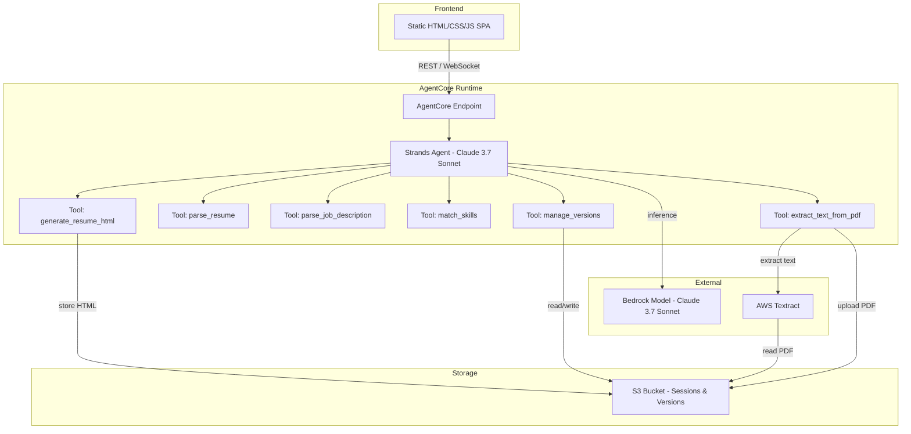
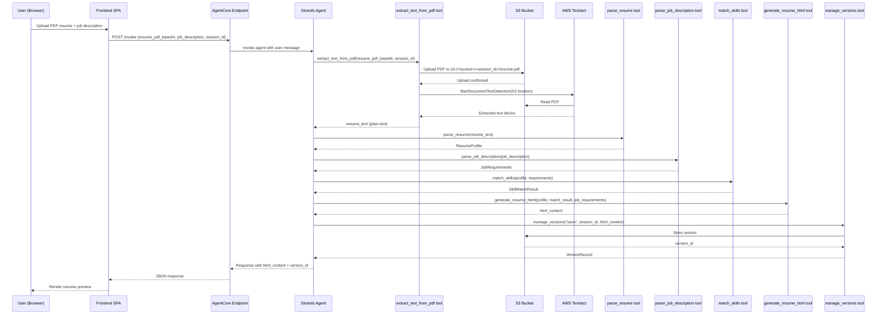
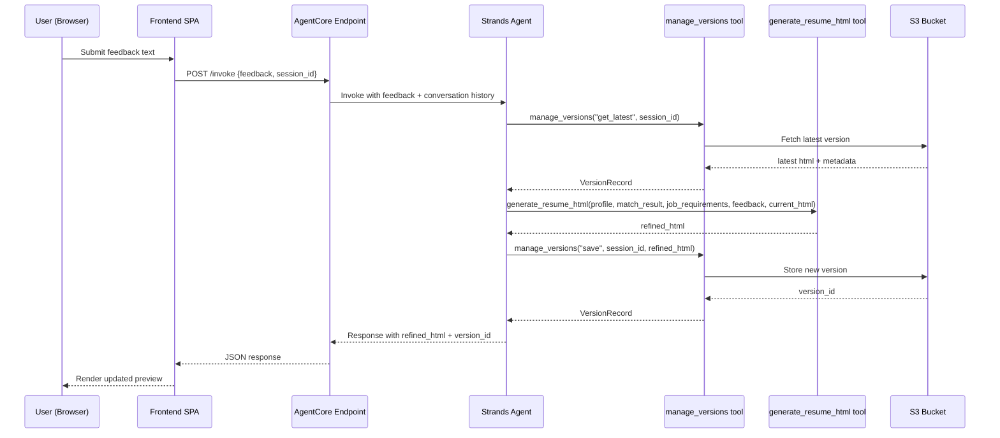

# Design Document: Resume Modifier Agent

## Overview

The Resume Modifier Agent is an AI-powered application that takes a user's existing resume/profile and a target job description, then generates a tailored, ATS-friendly resume using a Strands SDK agent deployed on Amazon Bedrock AgentCore. The system supports iterative refinement through conversational feedback, maintains version history per session, and delivers real-time progress updates via WebSocket.

The architecture replaces direct LLM API calls (as in the reference FastAPI app) with a model-driven Strands agent that orchestrates resume analysis, job matching, and HTML resume generation through composable tools. Deployment on AgentCore provides serverless scaling, built-in observability, and managed identity — eliminating the need to self-host the agent runtime.

Resume inputs are PDF files. The system uses AWS Textract to extract text from uploaded PDF resumes before parsing. The frontend uploads the PDF to S3, then the agent invokes Textract to extract the text content, which is then fed into the resume parsing pipeline.

The frontend is a static HTML/CSS/JS single-page application served independently (e.g., S3 + CloudFront or local dev server) that communicates with the AgentCore-hosted agent endpoint via REST and WebSocket.

## Architecture



## Sequence Diagrams

### Main Flow: Upload & Generate Resume



### Refinement Flow



## Components and Interfaces

### Component 1: Strands Agent (Core Orchestrator)

**Purpose**: Model-driven orchestrator that decides which tools to call and in what order based on user input. Uses Claude 3.7 Sonnet via Bedrock for reasoning.

**Interface**:
```python
from strands import Agent, tool
from strands.models.bedrock import BedrockModel

model = BedrockModel(
    model_id="us.anthropic.claude-3-7-sonnet-20250219-v1:0",
    region_name="us-west-2",
)

agent = Agent(
    model=model,
    tools=[extract_text_from_pdf, parse_resume, parse_job_description, match_skills, generate_resume_html, manage_versions],
    system_prompt=SYSTEM_PROMPT,
)
```

**Responsibilities**:
- Interpret user intent (generate, refine, list versions, download)
- Orchestrate tool calls in the correct sequence
- Maintain conversational context for iterative refinement
- Return structured responses to the frontend

### Component 2: AgentCore Entrypoint

**Purpose**: Wraps the Strands agent for serverless deployment on Bedrock AgentCore.

**Interface**:
```python
from bedrock_agentcore.runtime import BedrockAgentCoreApp

app = BedrockAgentCoreApp()

@app.entrypoint
def invoke(payload: dict) -> dict:
    ...
```

**Responsibilities**:
- Receive HTTP requests from AgentCore runtime
- Parse payload and route to agent
- Return structured JSON responses
- Handle session context propagation

### Component 3: Frontend SPA

**Purpose**: Static single-page application for user interaction — file upload, resume preview, feedback input, version navigation, PDF download.

**Responsibilities**:
- PDF file upload UI for resume (accepts `.pdf` files only) and text input for job description
- Encode uploaded PDF as base64 for transmission to the agent endpoint
- Real-time resume preview (rendered HTML)
- Feedback text input for iterative refinement
- Version history sidebar with navigation
- Client-side PDF generation (html2pdf.js or similar)
- Display upload progress and Textract extraction status

## Data Models

### ResumeProfile

```python
from dataclasses import dataclass, field

@dataclass
class ResumeProfile:
    name: str
    email: str
    phone: str
    summary: str
    skills: list[str]
    experience: list[ExperienceEntry]
    education: list[EducationEntry]
    certifications: list[str] = field(default_factory=list)
    projects: list[ProjectEntry] = field(default_factory=list)
```

### ExperienceEntry

```python
@dataclass
class ExperienceEntry:
    company: str
    title: str
    start_date: str
    end_date: str  # "Present" if current
    bullets: list[str]
```

### EducationEntry

```python
@dataclass
class EducationEntry:
    institution: str
    degree: str
    field_of_study: str
    graduation_date: str
```

### ProjectEntry

```python
@dataclass
class ProjectEntry:
    name: str
    description: str
    technologies: list[str]
```

### JobRequirements

```python
@dataclass
class JobRequirements:
    title: str
    company: str
    required_skills: list[str]
    preferred_skills: list[str]
    responsibilities: list[str]
    qualifications: list[str]
    keywords: list[str]  # ATS-relevant keywords extracted
```

### SkillMatchResult

```python
@dataclass
class SkillMatchResult:
    matched_skills: list[str]
    missing_skills: list[str]
    transferable_skills: list[str]  # user skills mappable to required ones
    keyword_coverage: float  # 0.0 to 1.0
    recommendations: list[str]  # suggestions for emphasis/reframing
```

### VersionRecord

```python
@dataclass
class VersionRecord:
    version_id: str
    session_id: str
    timestamp: str  # ISO 8601
    html_content: str
    feedback: str | None  # feedback that produced this version
    parent_version_id: str | None
```

**Validation Rules**:
- `session_id` must be a valid UUID
- `keyword_coverage` must be between 0.0 and 1.0
- `html_content` must be non-empty and valid HTML
- `timestamp` must be ISO 8601 format


## Key Functions with Formal Specifications

### Function 0: extract_text_from_pdf()

```python
@tool
def extract_text_from_pdf(resume_pdf_base64: str, session_id: str) -> str:
    """Extract text content from a PDF resume using AWS Textract.

    Decodes the base64-encoded PDF, uploads it to S3 under the session prefix,
    invokes Textract to perform text detection, and returns the concatenated
    extracted text in reading order.
    """
    ...
```

**Preconditions:**
- `resume_pdf_base64` is a non-empty, valid base64-encoded string
- Decoded content is a valid PDF file (starts with `%PDF` magic bytes)
- Decoded PDF size is between 1 KB and 10 MB (Textract synchronous API limit)
- `session_id` is a valid UUID string
- S3 bucket and Textract service are accessible with appropriate IAM permissions

**Postconditions:**
- PDF is uploaded to `s3://<bucket>/<session_id>/resume.pdf`
- Returns a non-empty string containing the extracted text
- Extracted text preserves reading order (top-to-bottom, left-to-right)
- Text blocks are joined with newlines to maintain paragraph structure
- Original PDF binary is not modified

**Error Conditions:**
- Invalid base64 encoding → raises `ValueError` with descriptive message
- Non-PDF content (invalid magic bytes) → raises `ValueError("Uploaded file is not a valid PDF")`
- PDF exceeds size limit → raises `ValueError("PDF exceeds maximum size of 10 MB")`
- Textract fails to extract text (corrupted PDF) → raises `RuntimeError("Textract could not extract text from the PDF")`
- Textract returns empty text (scanned image with no OCR content) → raises `RuntimeError("No text content found in PDF")`
- S3 upload failure → raises `RuntimeError` with S3 error details

### Function 1: parse_resume()

```python
@tool
def parse_resume(resume_text: str) -> dict:
    """Parse raw resume text into a structured ResumeProfile.

    Uses the agent's LLM to extract structured fields from unstructured resume text.
    Handles various resume formats (chronological, functional, combination).
    Accepts plain text extracted from PDF via Textract (extract_text_from_pdf tool).
    """
    ...
```

**Preconditions:**
- `resume_text` is a non-empty string (typically output from `extract_text_from_pdf`)
- `resume_text` length is between 100 and 50,000 characters

**Postconditions:**
- Returns a dict conforming to `ResumeProfile` schema
- `name` field is non-empty
- `skills` list contains at least one entry
- `experience` list is ordered by date descending
- Original text is not mutated

### Function 2: parse_job_description()

```python
@tool
def parse_job_description(job_description: str) -> dict:
    """Parse a job posting into structured JobRequirements.

    Extracts required/preferred skills, responsibilities, qualifications,
    and ATS-relevant keywords from the job description text.
    """
    ...
```

**Preconditions:**
- `job_description` is a non-empty string
- `job_description` length is between 50 and 30,000 characters

**Postconditions:**
- Returns a dict conforming to `JobRequirements` schema
- `required_skills` list contains at least one entry
- `keywords` list contains ATS-relevant terms extracted from the posting
- No fabricated requirements — all extracted from input text

### Function 3: match_skills()

```python
@tool
def match_skills(profile: dict, requirements: dict) -> dict:
    """Analyze alignment between a candidate's profile and job requirements.

    Identifies matched skills, gaps, transferable skills, and keyword coverage.
    Produces recommendations for how to reframe experience.
    """
    ...
```

**Preconditions:**
- `profile` conforms to `ResumeProfile` schema
- `requirements` conforms to `JobRequirements` schema
- Both inputs are non-empty

**Postconditions:**
- Returns a dict conforming to `SkillMatchResult` schema
- `keyword_coverage` is a float in [0.0, 1.0]
- `matched_skills` ⊆ `requirements.required_skills` ∪ `requirements.preferred_skills`
- `missing_skills` ∩ `matched_skills` = ∅ (no overlap)
- `recommendations` list is non-empty

**Loop Invariants:** N/A (single-pass analysis)

### Function 4: generate_resume_html()

```python
@tool
def generate_resume_html(
    profile: dict,
    match_result: dict,
    job_requirements: dict,
    feedback: str | None = None,
    current_html: str | None = None,
) -> str:
    """Generate or refine an ATS-friendly HTML resume.

    On first call (no current_html): generates a new resume from scratch.
    On refinement (current_html provided): applies feedback to improve the existing resume.
    """
    ...
```

**Preconditions:**
- `profile` conforms to `ResumeProfile` schema
- `match_result` conforms to `SkillMatchResult` schema
- `job_requirements` conforms to `JobRequirements` schema
- If `feedback` is provided, `current_html` must also be provided
- If `current_html` is provided, it must be valid HTML

**Postconditions:**
- Returns a non-empty string of valid HTML
- HTML uses semantic tags (`<section>`, `<h1>`–`<h3>`, `<ul>`, `<li>`) for ATS parsing
- No JavaScript or external resource references in output HTML
- All skills from `match_result.matched_skills` appear in the output
- If `feedback` was provided, the output reflects the requested changes

### Function 5: manage_versions()

```python
@tool
def manage_versions(
    action: str,
    session_id: str,
    html_content: str | None = None,
    version_id: str | None = None,
    feedback: str | None = None,
) -> dict:
    """Manage resume version history stored in S3.

    Actions:
      - "save": Store a new version. Requires html_content.
      - "get_latest": Retrieve the most recent version for a session.
      - "get": Retrieve a specific version by version_id.
      - "list": List all versions for a session.
    """
    ...
```

**Preconditions:**
- `action` ∈ {"save", "get_latest", "get", "list"}
- `session_id` is a valid UUID string
- If `action` == "save": `html_content` is non-empty
- If `action` == "get": `version_id` is non-empty

**Postconditions:**
- "save": Returns `VersionRecord` dict with new `version_id` and `timestamp`
- "get_latest": Returns `VersionRecord` or empty dict if no versions exist
- "get": Returns `VersionRecord` matching `version_id`, or raises error if not found
- "list": Returns list of `VersionRecord` dicts ordered by timestamp descending
- S3 state is only modified on "save" action

## Algorithmic Pseudocode

### Main Agent Workflow

```python
# This is the high-level algorithm the Strands agent follows,
# driven by the system prompt and model reasoning.

def agent_workflow(user_message: str, session_id: str, conversation_history: list) -> dict:
    """
    INPUT: user_message, session_id, conversation_history
    OUTPUT: dict with html_content, version_id, message

    PRECONDITION: session_id is valid UUID
    POSTCONDITION: response contains valid html_content or informative message
    """

    # Step 1: Classify intent
    intent = classify_intent(user_message, conversation_history)
    # intent ∈ {"generate", "refine", "list_versions", "get_version", "download"}

    if intent == "generate":
        # Step 2a: First-time generation
        # ASSERT: user_message contains resume_pdf_base64 and job_description
        resume_text = extract_text_from_pdf(resume_pdf_base64, session_id)
        profile = parse_resume(resume_text)
        requirements = parse_job_description(job_description)
        match_result = match_skills(profile, requirements)
        html = generate_resume_html(profile, match_result, requirements)
        version = manage_versions("save", session_id, html_content=html)
        return {"html_content": html, "version_id": version["version_id"], "message": "Resume generated"}

    elif intent == "refine":
        # Step 2b: Iterative refinement
        # ASSERT: conversation_history contains prior profile, match_result, requirements
        latest = manage_versions("get_latest", session_id)
        # ASSERT: latest is not empty (at least one version exists)
        html = generate_resume_html(
            profile, match_result, requirements,
            feedback=user_message,
            current_html=latest["html_content"],
        )
        version = manage_versions("save", session_id, html_content=html, feedback=user_message)
        return {"html_content": html, "version_id": version["version_id"], "message": "Resume refined"}

    elif intent == "list_versions":
        versions = manage_versions("list", session_id)
        return {"versions": versions, "message": f"Found {len(versions)} versions"}

    elif intent == "get_version":
        version = manage_versions("get", session_id, version_id=extract_version_id(user_message))
        return {"html_content": version["html_content"], "version_id": version["version_id"]}

    else:
        return {"message": "I can help you generate, refine, or manage resume versions."}
```

### ATS Keyword Optimization Algorithm

```python
def optimize_for_ats(profile: ResumeProfile, match_result: SkillMatchResult) -> ResumeProfile:
    """
    INPUT: profile (ResumeProfile), match_result (SkillMatchResult)
    OUTPUT: optimized ResumeProfile with improved keyword coverage

    PRECONDITION: profile is valid, match_result.keyword_coverage < 1.0
    POSTCONDITION: output.keyword_coverage >= input.keyword_coverage

    LOOP INVARIANT: Each iteration increases keyword presence in at least one field
    """

    optimized = deep_copy(profile)

    # Inject matched skills into summary if not already present
    for skill in match_result.matched_skills:
        if skill.lower() not in optimized.summary.lower():
            optimized.summary = weave_keyword_into_summary(optimized.summary, skill)

    # Reframe experience bullets to include transferable skill language
    for entry in optimized.experience:
        for i, bullet in enumerate(entry.bullets):
            for transferable in match_result.transferable_skills:
                if transferable.lower() not in bullet.lower():
                    entry.bullets[i] = reframe_bullet(bullet, transferable)
                    break  # one enhancement per bullet to keep natural

    # Ensure skills section includes all matched + transferable skills
    all_relevant = set(match_result.matched_skills + match_result.transferable_skills)
    current_skills = set(s.lower() for s in optimized.skills)
    for skill in all_relevant:
        if skill.lower() not in current_skills:
            optimized.skills.append(skill)

    return optimized
```

## AgentCore Entrypoint Implementation

```python
import json
import uuid
from strands import Agent, tool
from strands.models.bedrock import BedrockModel
from bedrock_agentcore.runtime import BedrockAgentCoreApp

app = BedrockAgentCoreApp()

SYSTEM_PROMPT = """You are a professional resume optimization agent. You help users create
tailored, ATS-friendly resumes by analyzing their profile against job descriptions.

You have access to tools for extracting text from PDF resumes (via AWS Textract),
parsing resumes, parsing job descriptions, matching skills,
generating HTML resumes, and managing version history.

Always follow this workflow:
1. Extract text from the uploaded PDF resume using extract_text_from_pdf
2. Parse the extracted resume text and job description
3. Analyze skill alignment
4. Generate an optimized HTML resume
5. Save the version

For refinement requests, retrieve the latest version and apply feedback.
Be specific about what changes you made and why."""

model = BedrockModel(
    model_id="us.anthropic.claude-3-7-sonnet-20250219-v1:0",
    region_name="us-west-2",
)

agent = Agent(
    model=model,
    tools=[extract_text_from_pdf, parse_resume, parse_job_description, match_skills, generate_resume_html, manage_versions],
    system_prompt=SYSTEM_PROMPT,
)


@app.entrypoint
def invoke(payload: dict) -> dict:
    """AgentCore entrypoint. Receives user requests and routes to the Strands agent."""
    session_id = payload.get("session_id", str(uuid.uuid4()))
    user_message = payload.get("message", "")

    if not user_message:
        return {"error": "message is required", "session_id": session_id}

    result = agent(user_message)

    return {
        "session_id": session_id,
        "response": str(result),
    }
```

## Example Usage

### Local Development & Testing

```python
# main.py — local testing before AgentCore deployment
from strands import Agent
from strands.models.bedrock import BedrockModel
from tools import extract_text_from_pdf, parse_resume, parse_job_description, match_skills, generate_resume_html, manage_versions

model = BedrockModel(model_id="us.anthropic.claude-3-7-sonnet-20250219-v1:0")
agent = Agent(model=model, tools=[extract_text_from_pdf, parse_resume, parse_job_description, match_skills, generate_resume_html, manage_versions])

# Generate a resume
response = agent("""
Here is my resume:
[resume text here]

Here is the job description:
[job description here]

Please generate a tailored resume.
""")
print(response)

# Refine with feedback
response = agent("Please emphasize my leadership experience more and add metrics to the bullet points.")
print(response)
```

### Deployment to AgentCore

```bash
# Initialize project with uv
uv init resume-modifier-agent
cd resume-modifier-agent
uv add strands-agents strands-agents-builder
uv add bedrock-agentcore
uv add amazon-textract-textractor

# Add dev dependency for local testing
uv add --dev bedrock-agentcore-starter-toolkit

# Configure AgentCore
agentcore configure

# Launch to AgentCore
agentcore launch

# Invoke the deployed agent
curl -X POST https://<endpoint-url>/invoke \
  -H "Content-Type: application/json" \
  -d '{"session_id": "abc-123", "message": "Here is my resume: ... Job description: ... Generate a tailored resume."}'
```

### Frontend Integration

```javascript
// frontend/app.js — key interaction patterns

async function generateResume(pdfFile, jobDescription) {
  const sessionId = crypto.randomUUID();

  // Read PDF file as base64
  const pdfBase64 = await new Promise((resolve, reject) => {
    const reader = new FileReader();
    reader.onload = () => resolve(reader.result.split(",")[1]); // strip data URL prefix
    reader.onerror = reject;
    reader.readAsDataURL(pdfFile);
  });

  const response = await fetch(`${AGENT_ENDPOINT}/invoke`, {
    method: "POST",
    headers: { "Content-Type": "application/json" },
    body: JSON.stringify({
      session_id: sessionId,
      message: `Job Description:\n${jobDescription}\n\nPlease generate a tailored resume.`,
      resume_pdf_base64: pdfBase64,
    }),
  });
  const data = await response.json();
  document.getElementById("preview").innerHTML = data.response;
  return { sessionId, data };
}

async function refineResume(sessionId, feedback) {
  const response = await fetch(`${AGENT_ENDPOINT}/invoke`, {
    method: "POST",
    headers: { "Content-Type": "application/json" },
    body: JSON.stringify({ session_id: sessionId, message: feedback }),
  });
  const data = await response.json();
  document.getElementById("preview").innerHTML = data.response;
  return data;
}

// File input handler — accepts PDF only
document.getElementById("resume-upload").addEventListener("change", (e) => {
  const file = e.target.files[0];
  if (file && file.type !== "application/pdf") {
    alert("Please upload a PDF file.");
    e.target.value = "";
  }
});
```


## Correctness Properties

*A property is a characteristic or behavior that should hold true across all valid executions of a system — essentially, a formal statement about what the system should do. Properties serve as the bridge between human-readable specifications and machine-verifiable correctness guarantees.*

### Property 1: PDF Input Validation Rejects Invalid Content

*For any* base64-encoded input whose decoded bytes do not start with the `%PDF` magic bytes, or whose base64 encoding is itself invalid, `extract_text_from_pdf` raises a `ValueError` before uploading to S3 or invoking Textract.

**Validates: Requirements 1.2, 2.1, 2.3**

### Property 2: Textract Text Block Assembly

*For any* list of text blocks returned by Textract, the PDF_Extractor concatenates them in reading order (top-to-bottom, left-to-right) joined by newlines, producing a single plain text string.

**Validates: Requirement 1.5**

### Property 3: Resume Parsing Produces Valid ResumeProfile

*For any* valid resume text (100–50,000 characters), `parse_resume` returns a dict conforming to the ResumeProfile schema with a non-empty name field, at least one skill, and experience entries ordered by date descending.

**Validates: Requirements 3.1, 3.2, 3.3, 3.4**

### Property 4: Job Parsing Produces Valid JobRequirements

*For any* valid job description text (50–30,000 characters), `parse_job_description` returns a dict conforming to the JobRequirements schema with at least one required skill and a non-empty keywords list.

**Validates: Requirements 4.1, 4.2, 4.3**

### Property 5: Skill Match Partitioning

*For any* ResumeProfile and JobRequirements, the Skill_Matcher produces a SkillMatchResult where `matched_skills ∪ missing_skills = required_skills` and `matched_skills ∩ missing_skills = ∅` — every required skill is classified as exactly matched or missing, with no overlap.

**Validates: Requirements 5.2, 5.3**

### Property 6: Keyword Coverage Bounds

*For any* SkillMatchResult produced by the Skill_Matcher, `keyword_coverage` is a float in the range [0.0, 1.0].

**Validates: Requirement 5.4**

### Property 7: Valid ATS HTML Output

*For any* inputs to `generate_resume_html`, the output is a non-empty string of valid HTML that uses semantic tags (`section`, `h1`–`h3`, `ul`, `li`) and contains no `<script>` tags or external resource references.

**Validates: Requirements 6.1, 6.2, 6.4**

### Property 8: ATS Keyword Inclusion

*For any* SkillMatchResult, all skills in `matched_skills` appear somewhere in the HTML output produced by `generate_resume_html`.

**Validates: Requirement 6.3**

### Property 9: Refinement Preservation

*For any* refinement operation with feedback, the output HTML preserves all factual information from the original ResumeProfile (name, dates, company names) unless the feedback explicitly requests removal.

**Validates: Requirement 6.6**

### Property 10: Version Round-Trip Integrity

*For any* html_content saved via `manage_versions("save", session_id, html_content)`, retrieving it via `manage_versions("get", session_id, version_id)` returns the exact same html_content.

**Validates: Requirements 7.1, 7.3**

### Property 11: Version Ordering Monotonicity

*For any* session, each successive `manage_versions("save", ...)` call produces a version_id and timestamp strictly greater than all previous versions. `get_latest` returns the most recent, and `list` returns all versions ordered by timestamp descending.

**Validates: Requirements 7.2, 7.4, 7.5**

### Property 12: Read Operations Are Side-Effect Free

*For any* session, calling `manage_versions` with actions "get", "get_latest", or "list" does not modify S3 state — the set of stored versions remains unchanged.

**Validates: Requirement 7.6**

### Property 13: Session Isolation

*For any* two distinct session_ids A and B, all S3 operations (PDF uploads, version saves, version reads) for session A are scoped to the `<session_id_A>/` key prefix and never read or modify data under `<session_id_B>/`.

**Validates: Requirements 8.1, 8.2, 8.3**

### Property 14: Error Recovery Preserves No Side Effects

*For any* PDF validation or Textract extraction error, the Agent returns an error message to the user and no VersionRecord is created for the session.

**Validates: Requirement 2.7**

## Error Handling

### Error Scenario 1: Invalid Resume PDF

**Condition**: Uploaded file is not a valid PDF (wrong format, corrupted, or empty)
**Response**: Agent returns a clear error message asking the user to upload a valid PDF file
**Recovery**: User re-submits with a valid PDF; no state change occurs

### Error Scenario 2: Textract Extraction Failure

**Condition**: AWS Textract fails to extract text from the PDF (corrupted PDF, scanned image with no OCR content, unsupported PDF features)
**Response**: Agent returns an error message explaining that text could not be extracted from the PDF, suggesting the user try a different PDF or a text-based resume format
**Recovery**: User uploads a different PDF; the failed PDF remains in S3 for debugging but no version is created

### Error Scenario 3: PDF Size Limit Exceeded

**Condition**: Uploaded PDF exceeds the 10 MB Textract synchronous API limit
**Response**: Agent returns an error message with the size limit and suggests the user reduce the PDF file size
**Recovery**: User compresses or re-exports the PDF and re-uploads

### Error Scenario 4: S3 Storage Failure

**Condition**: `manage_versions("save", ...)` fails due to S3 connectivity or permissions
**Response**: Agent returns the generated HTML in the response (so user doesn't lose work) with an error note about version storage
**Recovery**: User can retry; the HTML is still available in the response payload

### Error Scenario 5: Model Inference Timeout

**Condition**: Bedrock model call exceeds timeout (e.g., for very long resumes)
**Response**: AgentCore returns a 504 with a timeout message
**Recovery**: User retries with a shorter resume or the system can chunk processing

### Error Scenario 6: Session Not Found

**Condition**: `manage_versions("get_latest", session_id)` returns empty for a refinement request
**Response**: Agent informs user that no prior resume exists for this session and asks them to generate one first
**Recovery**: User starts a new generation flow

### Error Scenario 7: Invalid Feedback for Refinement

**Condition**: User sends feedback but it's ambiguous or contradictory
**Response**: Agent asks clarifying questions before proceeding with changes
**Recovery**: Conversational — agent uses follow-up to disambiguate

## Testing Strategy

### Unit Testing Approach

- Test each `@tool` function independently with known inputs and expected outputs
- Mock the LLM calls within tools to test parsing logic deterministically
- Validate data model schemas with edge cases (empty lists, missing optional fields)
- Test `manage_versions` with mocked S3 client (using `moto` library)
- Test `extract_text_from_pdf` with mocked S3 and Textract clients (using `moto` library)
- Test PDF validation logic (magic bytes check, size limits) with synthetic inputs

### Property-Based Testing Approach

**Property Test Library**: Hypothesis (Python)

- Generate random base64-encoded non-PDF content and verify `extract_text_from_pdf` rejects it with `ValueError`
- Generate random resume text variations and verify `parse_resume` always returns valid `ResumeProfile` schema
- Generate random skill lists and verify `match_skills` invariants (no overlap, complete coverage, valid coverage range)
- Generate random HTML content and verify `manage_versions` round-trip integrity (save then get returns same content)

### Integration Testing Approach

- End-to-end test: upload PDF resume + job description → Textract extraction → verify HTML output contains expected sections
- Textract integration test: upload a known PDF → verify extracted text matches expected content
- Refinement test: generate → refine with feedback → verify changes applied
- Version history test: generate multiple versions → list → verify ordering and count
- Use `bedrock-agentcore-starter-toolkit` for local AgentCore simulation during integration tests

## Performance Considerations

- **Cold Start**: AgentCore serverless may have cold start latency (~2-5s). Mitigate with provisioned concurrency for production.
- **Textract Latency**: Synchronous Textract `DetectDocumentText` adds ~1-5s depending on PDF page count and complexity. For multi-page resumes (typical 1-3 pages), expect ~2-3s.
- **LLM Latency**: Resume generation involves multiple tool calls, each potentially invoking the LLM. Expected end-to-end latency: 15-35s for initial generation (including Textract), 5-15s for refinement.
- **S3 Operations**: Version storage/retrieval adds ~100-200ms per operation. PDF upload to S3 adds ~200-500ms depending on file size. Use S3 Express One Zone for lower latency if needed.
- **PDF Size**: Cap PDF input at 10 MB (Textract synchronous API limit). Most resumes are well under 1 MB.
- **Resume Text Size**: Cap extracted text at 50,000 characters to stay within model context limits.
- **Concurrent Sessions**: AgentCore handles auto-scaling; no explicit concurrency management needed in application code.

## Security Considerations

- **Input Sanitization**: All user-provided text (job description, feedback) must be treated as untrusted. Uploaded PDFs must be validated (magic bytes, size limits) before processing. The HTML generation tool must not allow script injection in output.
- **PDF Upload Security**: Uploaded PDFs are stored in S3 under session-scoped prefixes. The agent's IAM role must have `s3:PutObject` for the upload prefix and `textract:DetectDocumentText` permissions. PDF content type is validated before upload.
- **Session Isolation**: S3 keys are prefixed with `session_id` to prevent cross-session data access. IAM policies restrict the agent's S3 access to the designated bucket/prefix. Textract operations are scoped to the session's S3 prefix.
- **PII Handling**: Resumes contain PII (name, email, phone). S3 bucket must have encryption at rest (SSE-S3 or SSE-KMS). No PII should be logged. PDF files in S3 should have lifecycle policies for automatic cleanup.
- **AgentCore Identity**: Use AgentCore's built-in identity controls to authenticate frontend requests. Do not expose the endpoint without authentication.
- **Model Prompt Injection**: The system prompt instructs the agent to only perform resume-related tasks. Tool inputs are validated before processing.

## Dependencies

| Dependency | Purpose | Version |
|---|---|---|
| `strands-agents` | Strands SDK for building the AI agent | latest |
| `strands-agents-builder` | Tool building utilities | latest |
| `bedrock-agentcore` | AgentCore runtime integration | latest |
| `bedrock-agentcore-starter-toolkit` | Local dev/test toolkit (dev only) | latest |
| `boto3` | AWS SDK for S3 and Textract operations | ^1.35 |
| `amazon-textract-textractor` | High-level Textract result parsing utilities | latest |
| `uv` | Python project/package manager | latest |
| `html2pdf.js` | Client-side PDF generation (frontend) | ^0.10 |
| `moto` | AWS service mocking for tests (dev only) | latest |
| `hypothesis` | Property-based testing (dev only) | latest |
| `pytest` | Test runner (dev only) | latest |
