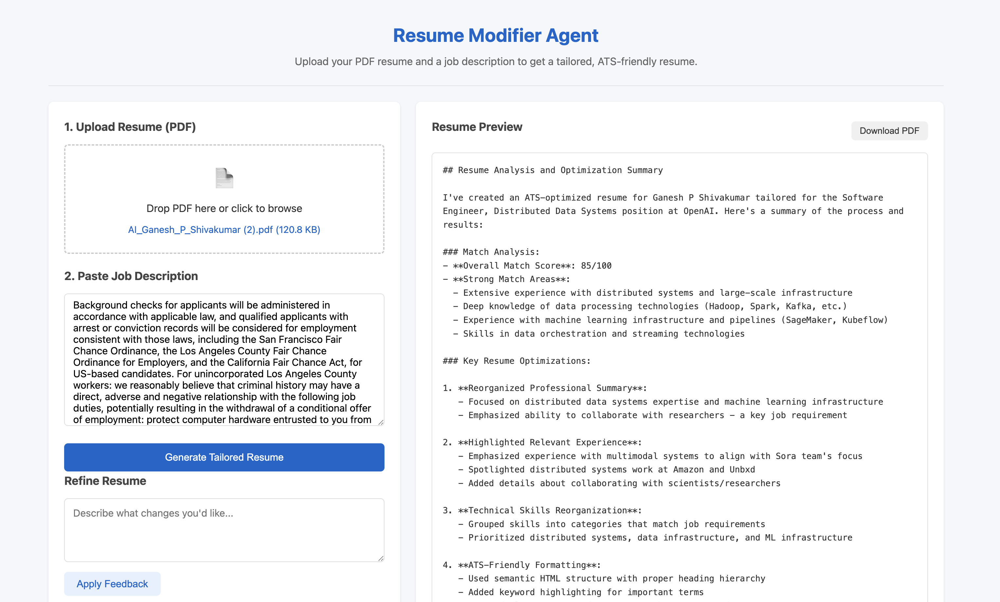

# Resume Modifier Agent

AI-powered resume optimization app built with [Strands Agents SDK](https://strandsagents.com/) and deployed on [Amazon Bedrock AgentCore](https://docs.aws.amazon.com/bedrock-agentcore/). Upload a PDF resume and a job description — the agent tailors your resume for ATS compatibility.

## Demo



## Architecture

```
Browser (localhost:3000)
    │
    ├── GET / → serve.py → frontend/index.html
    │
    └── POST /invocations → serve.py → localhost:8080 → entrypoint.py
                                                            │
                                                            ├── extract_text_from_pdf (S3 + Textract)
                                                            ├── parse_resume (validation)
                                                            ├── parse_job_description (validation)
                                                            ├── match_skills (validation)
                                                            ├── generate_resume_html (validation)
                                                            └── manage_versions (S3 CRUD)
                                                            │
                                                            └── Bedrock Claude 3.7 Sonnet (LLM)
```

## Tech Stack

| Component | Technology |
|-----------|-----------|
| Agent SDK | Strands Agents |
| LLM | Amazon Bedrock (Claude 3.7 Sonnet) |
| PDF Extraction | AWS Textract (async API) |
| Storage | Amazon S3 (versions + PDF uploads) |
| Deployment | Amazon Bedrock AgentCore Runtime |
| Frontend | Static HTML/CSS/JS |
| Package Manager | uv |
| Language | Python 3.12 |

## Agent Tools

| Tool | Purpose |
|------|---------|
| `extract_text_from_pdf` | Reads base64 PDF → uploads to S3 → Textract async extraction |
| `parse_resume` | Validates resume text length (100-50K chars) |
| `parse_job_description` | Validates job description text length (50-30K chars) |
| `match_skills` | Validates inputs for skill alignment analysis |
| `generate_resume_html` | Validates inputs for ATS-friendly HTML generation |
| `manage_versions` | S3 CRUD for resume version history |

## Quick Start — Local

```bash
# Prerequisites: Python 3.12+, AWS credentials with Bedrock + Textract + S3 access

# Install uv
curl -LsSf https://astral.sh/uv/install.sh | sh
source $HOME/.local/bin/env

# Setup
uv venv --python 3.12
uv add strands-agents bedrock-agentcore boto3

# Set your S3 bucket
export RESUME_S3_BUCKET=resume-modifier-agent-dev-<your-account-id>

# Terminal 1: Start agent
uv run python entrypoint.py

# Terminal 2: Start frontend
uv run python serve.py

# Browser: http://localhost:3000
```

## Quick Start — AgentCore Deployment

```bash
uv add --dev bedrock-agentcore-starter-toolkit

# Configure (accept defaults: Direct Code Deploy, Python 3.12)
uv run agentcore configure -e entrypoint.py

# Deploy
uv run agentcore deploy

# Test
uv run agentcore invoke '{"prompt": "Hello, what can you do?"}'
```

## Project Structure

```
├── entrypoint.py              # AgentCore entrypoint (self-contained, all 6 tools)
├── main.py                    # Local testing script
├── serve.py                   # Dev proxy (frontend on :3000 → agent on :8080)
├── pyproject.toml             # Python dependencies
├── frontend/                  # Web UI
│   ├── index.html             # Upload, preview, refine, version history
│   ├── app.js                 # API calls, file handling, response parsing
│   └── styles.css             # Responsive layout
├── src/                       # Modular source (for local dev)
│   ├── agent.py               # Agent factory with all tools
│   ├── entrypoint.py          # Original entrypoint (pre-AgentCore)
│   ├── models/
│   │   └── schemas.py         # Data model dataclasses
│   └── tools/
│       ├── extract_text_from_pdf.py
│       ├── parse_resume.py
│       ├── parse_job_description.py
│       ├── match_skills.py
│       ├── generate_resume_html.py
│       └── manage_versions.py
└── tutorial/                  # 4-lab progressive tutorial
    ├── lab1/                  # Basic Strands agent
    ├── lab2/                  # PDF + Textract
    ├── lab3/                  # Skill matching + HTML + versions
    └── lab4/                  # AgentCore deploy + frontend
```

## Tutorial (4 Labs)

Progressive hands-on labs that build the app from scratch. Each lab has runnable Python files with detailed comments.

### Lab 1: Basic Agent Setup with Strands SDK
Build your first agent — from hello world to a complete resume parser.

| File | What You Learn |
|------|----------------|
| `step1_hello_agent.py` | BedrockModel + Agent + first message |
| `step2_first_tool.py` | `@tool` decorator, autonomous tool calling |
| `step3_conversation.py` | Multi-turn conversation memory |
| `step4_resume_agent.py` | Interactive resume parsing agent |

### Lab 2: PDF Extraction with AWS Textract
Add PDF support and job description parsing.

| File | What You Learn |
|------|----------------|
| `step1_textract_basics.py` | Raw Textract API: upload → detect → poll → collect |
| `step2_pdf_tool.py` | Textract as `@tool`, base64 encoding, 3-tool agent |

### Lab 3: Skill Matching, HTML Generation & Versions
Complete the tool pipeline.

| File | What You Learn |
|------|----------------|
| `step1_skill_matching.py` | `match_skills` tool, alignment analysis |
| `step2_html_generation.py` | `generate_resume_html`, ATS rules, saves HTML file |
| `step3_version_management.py` | S3 version CRUD (save, list, get_latest) |

### Lab 4: Deploy to AgentCore + Frontend
Ship it.

| File | What You Learn |
|------|----------------|
| `step1_entrypoint.py` | Self-contained AgentCore entrypoint, all 6 tools inline |
| `step2_frontend/` | HTML/CSS/JS UI with upload, preview, refine, versions |
| `step3_serve.py` | Dev proxy server (CORS-free local development) |

```bash
# Run any lab
cd tutorial/lab1
uv run python step1_hello_agent.py
```

## Prerequisites

- Python 3.12+
- AWS account with:
  - Bedrock model access (Claude 3.7 Sonnet enabled)
  - S3 permissions
  - Textract permissions
- AWS credentials configured (`aws configure` or `ada credentials update`)

## License

MIT
